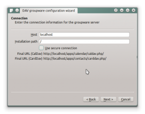
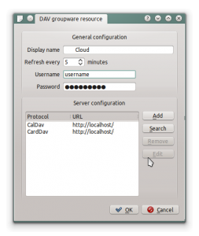
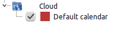
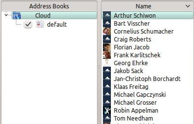

Synchronizing with KDE SC
=========================

.. image:: /images/kdes1.png

From KDE SC 4.8 and forward setting up |cloudName| is very easy. From System
Settings Personal Information/Akonadi Resources Configuration select DAV
Groupware resource.

.. image:: ../images/kdes2.png

Enter your |cloudName| username and password and click "Next".

.. image:: ../images/kdes3.png

Select own Cloud in the drop down list and click "Next".

Enter the host name (|cloudUrl|) and installation path. 

.. image:: ../images/kdes5.png

Test the connection. If everything went well you should see a message
like the one below.

Click "Finish" and you will be able to change the display name and
refresh interval.

.. image:: ../images/kdes7.png

Now you should see the Akonadi resource doing the first
synchronization.

..  missing
..  .. image:: ../images/kdes8.png

You can find the Contacts and Calendars in Kontact (or
KOrganizer/KAddressbook if you run the programs separately.)

